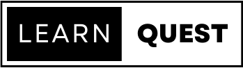

<a name="readme-top"></a>


<!-- PROJECT LOGO -->
<br />
<div align="center">
  <a href="https://github.com/bcsamrudh/LearnQuest/blob/main/Images/logo.png">
    
  </a>

  <h3 align="center">LearnQuest</h3>

  <p align="center">
    Your Ultimate Study Hub 📖 Share, Discuss, and Generate Questions with AI-powered convenience. Elevate your learning game with ease!
  </p>
</div>


<!-- TABLE OF CONTENTS -->
<details>
  <summary>Table of Contents</summary>
  <ol>
    <li>
      <a href="#about-the-project">About The Project</a>
      <ul>
        <li><a href="#built-with">Built With</a></li>
      </ul>
    </li>
    <li>
      <a href="#setting-up-the-project">Setting Up the Project</a>
    </li>
  </ol>
</details>


<!-- ABOUT THE PROJECT -->
## About The Project
<p align="center">
    <a href="https://www.youtube-nocookie.com/embed/i71r4OBmgIc?si=jHJ0XgSd-IZIZKmA">Watch The Demo Video</a>
</p>


LearnQuest is a website that helps students share study notes and generate questions based on the notes using AI. It allows students to upload their notes, which are then used by AI to generate questions. Students can also view and comment on each other's notes, which helps them to learn from each other and improve their understanding of the material.

LearnQuest provides the following features:

- **Note Sharing**: Users can upload and share their notes with the community.
- **Comments**: Users can comment on notes to provide feedback or ask questions.
- **Upvoting**: Users can upvote their favorite notes to show appreciation.
- **Note Download**: Users can download notes for offline access.
- **Question Generation**: Users can generate questions based on the content of the notes.
- **Accessible UI**: The website is made accessible so that everybody can take advantage of the website.

<p align="right">(<a href="#readme-top">back to top</a>)</p>


### Built With

This section should list any major frameworks/libraries used to bootstrap your project. Leave any add-ons/plugins for the acknowledgements section. Here are a few examples.

* 
* 
* 
* 
* 
* **Django-unicorn** : Django-unicorn is a Django library that integrates with the Unicorn library to provide real-time, reactive components in Django applications.
* **Google Gemini API** : The Google Gemini API is used to generate questions based on the content of the notes.


<p align="right">(<a href="#readme-top">back to top</a>)</p>


<!-- GETTING STARTED -->
## Setting Up the Project

To set up the LearnQuest project on your local machine, follow these steps:

1. Clone the repository to your local machine using the following command:

   ```
   git clone <repository-url>
   ```

1. Navigate to the project directory:

   ```
   cd learnquest
   ```

1. Create a virtual environment to isolate the project's dependencies:

   ```
   python -m venv venv
   ```

1. Activate the virtual environment:

   - On Windows:

     ```
     venv\Scripts\activate
     ```

   - On macOS and Linux:

     ```
     source venv/bin/activate
     ```

1. Install the project dependencies:

   ```
   pip install -r requirements.txt
   ```

1. Apply the database migrations:

   ```
   python manage.py migrate
   ```

1. Start the development server:

   ```
   python manage.py runserver
   ```

1. Open your web browser and visit `http://localhost:8000` to access LearnQuest.

<p align="right">(<a href="#readme-top">back to top</a>)</p>


<!-- USAGE EXAMPLES -->
## Usage

## Sign-Up on the Website


## Browse through a List of Notes Uploaded


## View a Note In Detail


## Generate Question Based on the notes


## Upload Notes


## Sign-In Page of the Website


## About Page of the Website


